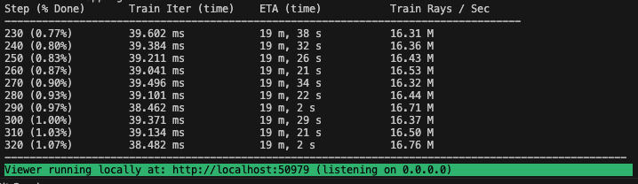

<div align="center">
<h3 style="font-size:2.0em;">Street-Gaussians-ns</h3>
</div>
<div align="center">

[Introduction](#introduction) ·
[Quickstart](#quickstart) ·
[Acknowledgements](#acknowledgements)

</div>

# Introduction

## About
This repository is an unofficial implementation of "[Street Gaussians for Modeling Dynamic Urban Scenes](https://arxiv.org/abs/2401.01339)", building on top of the [Nerfstudio](https://github.com/nerfstudio-project/nerfstudio) framework. 

Our goal in reproducing and open-sourcing this work is to provide a basic reference for the self-driving community and to inspire more work. Any creative ideas are welcome to be discussed with us! Feel free to contact with us by email: contact@lightwheel.ai

<div align="center">
<a href="https://lightwheel.ai/images/logo.png?tr:f-avif&t=1">
</a>
</div>

<div align="center">
<a href="https://lightwheel-website.vercel.app/">
<picture style="padding-left: 30px; padding-right: 30px;">
    <source media="(prefers-color-scheme: dark)" srcset="assets/imgs/logo/logo-dark-en-transparent.svg" />
    
</picture>
</a>
</div>

## Results

Waymo:

https://github.com/LightwheelAI/street-gaussians-ns/assets/159144751/243e514a-bc8d-46e1-b9bf-cdbf5feef5f8

https://github.com/LightwheelAI/street-gaussians-ns/assets/159144751/7456761b-2733-442e-8b95-1057e77d2a51

https://github.com/LightwheelAI/street-gaussians-ns/assets/159144751/91094bee-5ba4-41f7-a4d7-f51cda2a3b83

https://github.com/LightwheelAI/street-gaussians-ns/assets/159144751/eb87a092-0ddb-4b94-97fc-fa33a6bd17a8

Waymo:

<table>
    <tr>
        <th rowspan="2">Sequence</th><th rowspan="2">frame</th><th colspan="2">Paper</th><th colspan="2">This repo</th>
    </tr>
    <tr>
        <td>PSNR</td><td>SSIM</td><td>PSNR</td><td>SSIM</td>
    </tr>
    <tr>
        <td>10448102132863604198</td><td> [0,85] </td><td>33.50</td><td>0.945</td><td>33.12</td><td>0.942</td>
    </tr>
    <tr>
        <td>2094681306939952000</td><td> [20,115] </td><td>36.70</td><td>0.955</td><td>35.72</td><td>0.960</td>
    </tr>
    <tr>
        <td>8398516118967750070</td><td> [0,160] </td><td>36.74</td><td>0.948</td><td>38.29</td><td>0.965</td>
    </tr>
</table>

Training time is about 0.5 hours per sequence on 1 RTX4090.

# Quickstart

The quickstart will help you get started with the street-gaussians model on a Waymo sequence.

## 1. Installation: Setup the environment

### Prerequisites

Our installation steps largely follow Nerfstudio, with some added dataset-specific dependencies. You must have an NVIDIA video card with CUDA installed on the system. This library has been tested with version 11.8 of CUDA. You can find more information about installing CUDA [here](https://docs.nvidia.com/cuda/cuda-quick-start-guide/index.html).

### Create environment


```bash
conda create --name street-gaussians-ns -y python=3.8
conda activate street-gaussians-ns
pip install --upgrade pip
```

### Dependencies

Install PyTorch with CUDA (this repo has been tested with CUDA 11.8) and [tiny-cuda-nn](https://github.com/NVlabs/tiny-cuda-nn).
`cuda-toolkit` is required for building `tiny-cuda-nn`.

For CUDA 11.8:

```bash
pip install torch==2.1.2+cu118 torchvision==0.16.2+cu118 --extra-index-url https://download.pytorch.org/whl/cu118

conda install -c "nvidia/label/cuda-11.8.0" cuda-toolkit
pip install ninja git+https://github.com/NVlabs/tiny-cuda-nn/#subdirectory=bindings/torch
```

Install nerfstudio.

```bash
pip install nerfstudio
```

We refer to [Nerfstudio](https://github.com/nerfstudio-project/nerfstudio/blob/v1.0.3/docs/quickstart/installation.md) for more installation support.

### Installing Street-Gaussians-ns

Clone and Install street-gaussians-ns.
We use cube map to represent sky.

```bash
git clone https://github.com/LightwheelAI/street-gaussians-ns.git --recursive

cd street-gaussians-ns

pip install -e .

pip install dependencies/nvdiffrast/
```

### Install data processsing tools

For segments generating, which is necessary to model sky, ***Mask2Former*** is required. 

```bash
cd dependencies/detectron2
pip install -e .

cd dependencies/Mask2Former
pip install -r requirements.txt
cd mask2former/modeling/pixel_decoder/ops
sh make.sh
```

After installing Mask2Former, we need to download the pretrained [model](https://dl.fbaipublicfiles.com/maskformer/mask2former/mapillary_vistas/semantic/maskformer2_swin_large_IN21k_384_bs16_300k/model_final_90ee2d.pkl) and place it at ```dependencies/mask2former/models```

We refer to [Detectron2](https://github.com/facebookresearch/detectron2/blob/main/INSTALL.md) and [Mask2Former](https://github.com/facebookresearch/Mask2Former/blob/main/INSTALL.md) for more installation support.


## 2. Training your first model!

The following will train a street-gaussians-ns model, our recommended model for real world AD scenes.

### Data preparation

Begin by downloading [dataset](https://console.cloud.google.com/storage/browser/waymo_open_dataset_v_1_4_0) from [Waymo](https://github.com/waymo-research/waymo-open-dataset) and unzip it, we use waymo perception_v1.4.0 to test our model.

Use the script to extract it to our data structure.

```
python scripts/python/extract_waymo.py --waymo_root path/to/your/waymo_root --out_root path/to/your/out_root
```

After this step you will get our dataset format as follow:
```
clip root
  |-- images
  |     |-- ${cam0 name}
  |     |   |-- t0.jpg/png
  |     |   |-- t1.jpg/png
  |     |   |-- ...
  |     |
  |     |-- ${cam1 name}
  |     |-- ...
  |
  |-- lidars
  |     |-- ${lidar0 name}
  |     |   |-- t0.pcd
  |     |   |-- t1.pcd
  |     |   |-- ...
  |     |
  |     |-- ${lidar1 name}
  |     |-- ...
  |
  |-- transform.json
  |-- annotation.json
```

Then you can follow the ```data_process.sh``` to finish data processing.

If you can't run ```segs_generate.py``` successfully, please try to copy it under ```dependencies/Mask2Former``` and run it again.

If you want only test the model or have problem in data preprocessing, we offer our preprocessed dataset!

<table>
    <tr>
        <th>Sequence</th>
    </tr>
    <tr>
        <td ><a href="http://lightwheel.cn-sh2.ufileos.com/waymo_10588771936253546636_2300_000_2320_000.tar.gz?UCloudPublicKey=4eZBdiT75eP4RpoD8jjlUyHe081C3gXg4&Expires=1748076341&Signature=ZeY9BwbW5rbzFceUa+273IAF/DA=">10588771936253546636</a></td>
    </tr>
    <tr>
        <td ><a href="http://lightwheel.cn-sh2.ufileos.com/waymo_10448102132863604198_472_000_492_000.tar.gz?UCloudPublicKey=4eZBdiT75eP4RpoD8jjlUyHe081C3gXg4&Expires=1748078515&Signature=B/pAhsXeW1A6zbJi0ORB1Zugk1s=">10448102132863604198</a></td>
    </tr>
    <tr>
        <td><a href="http://lightwheel.cn-sh2.ufileos.com/waymo_2094681306939952000_2972_300_2992_300.tar.gz?UCloudPublicKey=4eZBdiT75eP4RpoD8jjlUyHe081C3gXg4&Expires=1748078515&Signature=Mea4Fv6nCj8iNrp7G0LroSQOzWc=">2094681306939952000</a></td>
    </tr>
    <tr>
        <td><a href="http://lightwheel.cn-sh2.ufileos.com/waymo_8398516118967750070_3958_000_3978_000.tar.gz?UCloudPublicKey=4eZBdiT75eP4RpoD8jjlUyHe081C3gXg4&Expires=1748078515&Signature=yD3hY1hGE0nMkrL78MxYPrA5v2M=">8398516118967750070</a></td>
    </tr>
</table>

### Training

Training models is done conveniently by scripts.

```bash
# Train model
bash scripts/shells/train.sh path/to/your/dataset cuda_id
```

If everything works, you should see training progress like the following:

<p align="center">
    
</p>

## 3. Exporting Results


### Evaluating and Rendering

Evaluating and rendering models is done conveniently by scripts.

```bash
# Eval model
bash scripts/shells/eval.sh path/to/your/output/config.yaml cuda_id

# Render model
bash scripts/shells/render.sh path/to/your/output/config.yaml cuda_id
```

If you want to render a novel view video, following steps could be helpful.
1. Create a json file with following format(or use our ```nvs_template.json``` in ```scripts```).
2. Specify the json file using ```--vehicle-config``` of ```sgn-render```.
3. Get a novel view video!
```
[
    {
        "camera": "FRONT",
        "image_path_patten": ".*/FRONT/.*",
        "transform": [
            [
                1.0,
                0.0,
                0.0,
                0.0
            ],
            [
                0.0,
                1.0,
                0.0,
                0.0
            ],
            [
                0.0,
                0.0,
                1.0,
                0.0
            ],
            [
                0.0,
                0.0,
                0.0,
                1.0
            ]
        ]
    },
    
]
```

### Exporting

Your can use the following script to export nerfstudio model to a ply file as 3DGS.

```bash
# Export model
bash scripts/shells/export.sh path/to/your/output/config.yaml
```

### Modify Configuration

Each model contains many parameters that can be changed, too many to list here. 

There are three ways to modify the configuration:
1. modify the Config class' parameter in the model file
2. modify the method_config.py file
3. modify parameters in the command, i.e. train.sh file

### Tensorboard / WandB / Comet / Viewer

There are four different methods to track training progress, using the viewer, [tensorboard](https://www.tensorflow.org/tensorboard), [Weights and Biases](https://wandb.ai/site), and [Comet](https://comet.com/?utm_source=nerf&utm_medium=referral&utm_content=github). You can specify which visualizer to use by appending `--vis {viewer, tensorboard, wandb, comet viewer+wandb, viewer+tensorboard, viewer+comet}` to the training command. Simultaneously utilizing the viewer alongside wandb or tensorboard may cause stuttering issues during evaluation steps.

For more usage or information, please see https://github.com/nerfstudio-project/nerfstudio.

# TODO
- [x] Release main part code
- [x] Release data processing part code
- [x] Release preprocessed dataset

# Acknowledgements

## Built On

<a href="https://github.com/nerfstudio-project/nerfstudio">
<picture>
    <source media="(prefers-color-scheme: dark)" srcset="https://raw.githubusercontent.com/nerfstudio-project/nerfstudio/main/docs/_static/imgs/logo-dark.png" />
    
</picture>
</a>

- Collaboration friendly studio for NeRFs

## Citation
```
@misc{yan2024street,
      title={Street Gaussians for Modeling Dynamic Urban Scenes}, 
      author={Yunzhi Yan and Haotong Lin and Chenxu Zhou and Weijie Wang and Haiyang Sun and Kun Zhan and Xianpeng Lang and Xiaowei Zhou and Sida Peng},
      year={2024},
      eprint={2401.01339},
      archivePrefix={arXiv},
      primaryClass={cs.CV}
}
```

## Contributors

<a href="https://github.com/filick">
    
</a>
<a href="https://github.com/16Huzeyu">
    
</a>
<a href="https://github.com/gusongen">
    
</a>
<a href="https://github.com/seasideGargantua">
    
</a>


\+ [nerfstudio contributors](https://github.com/nerfstudio-project/nerfstudio/graphs/contributors)
